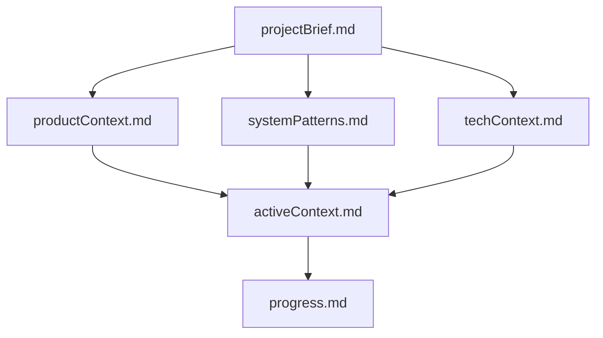

# System Patterns

This document outlines the architectural patterns and design decisions employed in the project.

## Architectural Pattern: Model-View-Presenter (MVP)

The project strictly adheres to the Model-View-Presenter (MVP) architectural pattern to ensure a clear separation of concerns, enhance testability, and promote maintainability.

*   **Model:** Represents the data and business logic. In this project, the `core` module encapsulates the Model, including data structures (e.g., `User`, `Message`), API service interactions (`ApiService`, `AuthService`), and any data persistence logic. It is independent of the UI.
*   **View:** Responsible for displaying data and capturing user input. The `ui-swing` module implements the View using Java Swing components (`JFrame`, `JPanel`). Views are passive and delegate user interactions to the Presenter.
*   **Presenter:** Acts as the intermediary between the Model and the View. It retrieves data from the Model, formats it for display in the View, and handles user input from the View, updating the Model accordingly. Presenters are responsible for the UI logic.

## Module Structure:

The project is divided into two primary Maven modules:

1.  **`core` Module:**
    *   Contains all business logic, data models, and service interfaces.
    *   Independent of any UI framework.
    *   Provides the foundation for client-server communication.

2.  **`ui-swing` Module:**
    *   Implements the user interface using Java Swing.
    *   Depends on the `core` module.
    *   Houses the View and Presenter components.

## File Structure:

The project follows a structured directory layout:

```
chat_java_client/
├── pom.xml                 // Main Maven project file
├── core/
│   ├── pom.xml
│   └── src/main/java/com/chatapp/core/
│       ├── model/          // Data models
│       ├── service/        // Business logic and API interaction
│       └── repository/     // Data persistence (if applicable)
└── ui-swing/
    ├── pom.xml
    └── src/main/java/com/chatapp/ui/
        ├── Main.java       // Application entry point
        ├── view/           // Swing UI components (Views)
        └── presenter/      // Presenter logic
```

## Memory Bank Structure:

The Memory Bank itself follows a hierarchical structure to organize project knowledge:


This structure ensures that core project information is readily accessible and builds upon foundational documents.
